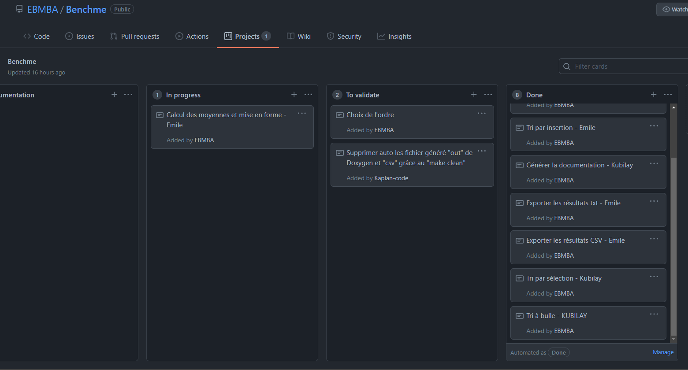

# TP 2 - Algorithmes de tri - Benchme
## Auteur : Kubilay Kaplan et Emile Metral

# But du TP
Dans ce Tp nous allons implémenter 4 algorithmes de tri (tri a bulle, tri par sélection, tri par insertion, tri pas tas)
permettant un tri croissant ou décroissant d’un tableau de nombre a virgules.

Les temps d'exécution de chacun des tris seront mesurés et exporter au format Csv. Ces benchmarks permettront d’avoir une estimation de la complexité temporelle.

# Documentation
Le code est documenté, il est commenté et annoté au format Doxygen. La documentation technique peut être extraite grace à une commande contenu dans le Makefile.

Commande pour generer la documentation : `make documentation`

Commande pour utiliser le programme : `./output/benchme nomDuFichier`

# Gestion de projet
Pour la gestion du projet nous avons utilisé la méthode agile pour nous fixé des objectifs à court terme et ainsi être plus performant.  

# Résultats attendus
Il est demandé à l'utilisateur de choisir une taille pour le nombre de valeurs à trier. Il est possible de rentrer `0` pour utiliser les nombres de valeurs prédéfinient qui sont : 100, 1000, 10000 et 100000 valeurs. Si l'utilisateur rentre un nombre inférieur à 10 alors il pourra vérifier le tri dans le fichier d'exportation et il pourra choisir l'ordre (croissant/décroissant). Chaque valeur est testé 3 fois.

# Evolutions à venir
* Ajout de nouveaux algorithmes de tri.
